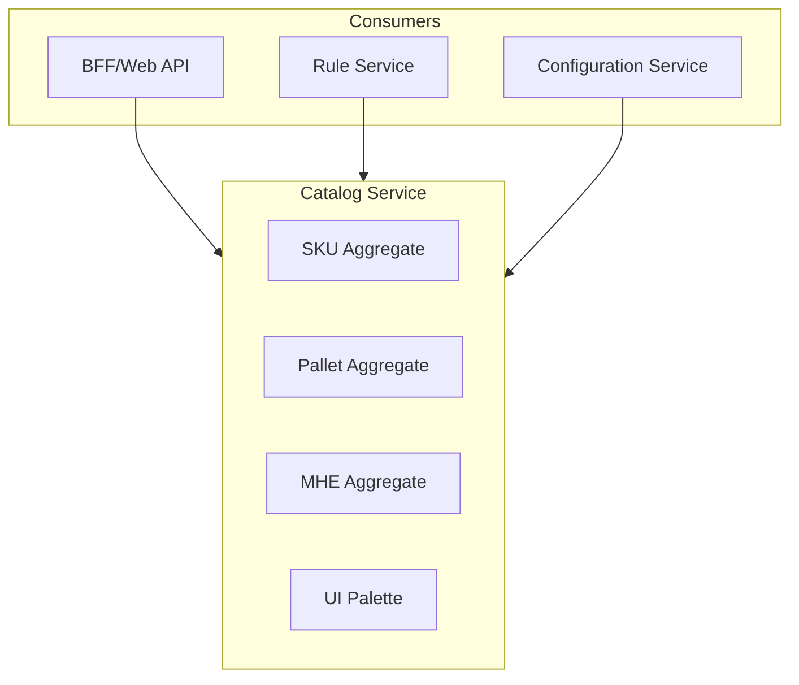

# Catalog Service Scope

## What the Catalog Service Manages

## Aggregate Boundaries

| Aggregate | Responsibility | Key Attributes |
|-----------|----------------|----------------|
| **SKU** | Stock keeping unit definition | Code, Name, GLB File, Status |
| **Pallet** | Pallet type definition | Code, Name, Type, Dimensions |
| **MHE** | Material handling equipment | Code, Name, Equipment Type |
| **Palette** | UI component configuration | Groups, Categories, Roles |

## Integration Scope

### Provides Data To

- **BFF** — Palette configuration, component lookups
- **Rule Service** — Component attributes, load charts
- **Configuration Service** — Component references for configurations

### Receives Data From

- **Admin Portal** — CRUD operations on catalog items
- **Import Jobs** — Bulk catalog updates

## Feature Matrix

| Feature | SKU | Pallet | MHE | Palette |
|---------|-----|--------|-----|---------|
| CRUD Operations | ✅ | ⚠️ | ⚠️ | ❌ |
| Soft Delete | ✅ | ⚠️ | ⚠️ | N/A |
| 3D Model Reference | ✅ | ❌ | ❌ | ❌ |
| Status Toggle | ✅ | ⚠️ | ⚠️ | N/A |
| Role Filtering | ❌ | ❌ | ❌ | ✅ |

✅ Implemented | ⚠️ Domain Model Only | ❌ Not Applicable
