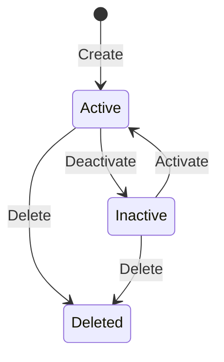

# Aggregates and Invariants

## Aggregate Overview

| Aggregate | Root Entity | Key Invariants |
|-----------|-------------|----------------|
| [SKU](../03-aggregates/sku/) | `Sku` | Code unique, GLB valid |
| [Pallet](../03-aggregates/pallet/) | `Pallet` | Code unique |
| [MHE](../03-aggregates/mhe/) | `Mhe` | Code unique |

---

## SKU Aggregate

### Root: `Sku`

### Invariants

1. **Code Uniqueness** — No two active SKUs can have the same code
2. **Name Required** — SKU must have a non-empty name
3. **Delete Protection** — Deleted SKUs cannot be modified
4. **GLB Reference** — GLB file path must be valid URI if provided

### Lifecycle

---

## Pallet Aggregate

### Root: `Pallet`

### Invariants

1. **Code Uniqueness** — No two active pallets can have the same code
2. **Name Required** — Pallet must have a non-empty name
3. **Type Validation** — Pallet type must be from allowed enum

---

## MHE Aggregate

### Root: `Mhe`

### Invariants

1. **Code Uniqueness** — No two active MHE can have the same code
2. **Name Required** — MHE must have a non-empty name
3. **Equipment Type** — Must be valid equipment type enum
