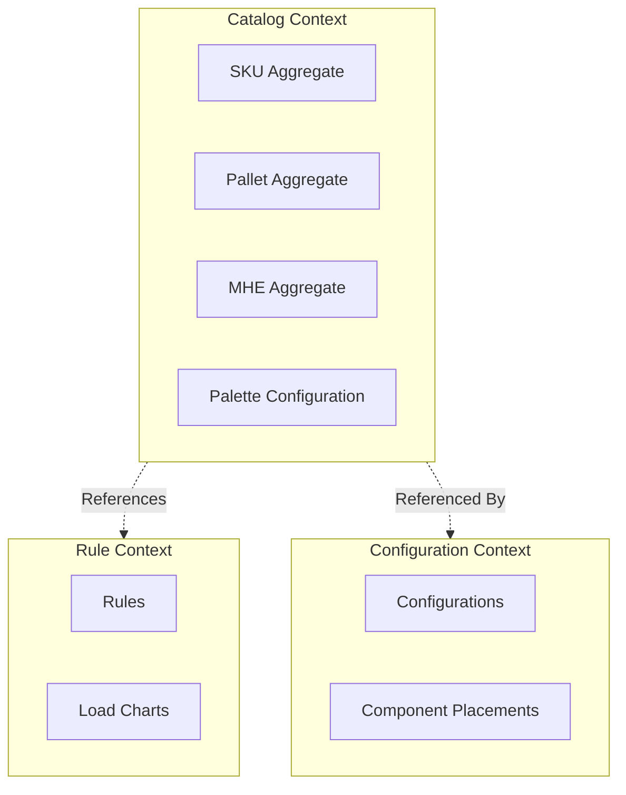

# Bounded Contexts

## Catalog Context

The Catalog Service is a single bounded context focused on **component definitions**.

## Context Relationships

| Context | Relationship | Communication |
|---------|--------------|---------------|
| Rule Service | Upstream (provides load charts) | Sync API |
| Configuration Service | Downstream (references catalog) | Sync API |
| BFF | Downstream (UI data) | REST API |
| Admin Portal | Downstream (CRUD operations) | REST API |

## Integration Patterns

### Catalog → Rule Service

- Catalog provides SKU attributes
- Rule Service caches load charts
- Rule Service queries capacity by SKU

### Configuration → Catalog

- Configuration references SKU IDs
- Catalog validates component existence
- Catalog provides 3D model URLs
