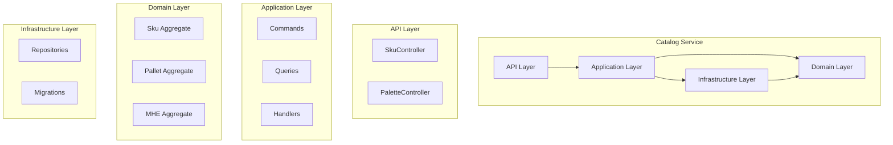

# Container Diagram

C4 Level 2: Container diagram showing internal components within the Catalog Service.

## Layer Responsibilities

| Layer | Responsibility | Technologies |
|-------|----------------|--------------|
| API | HTTP endpoints, validation | ASP.NET Core, Swagger |
| Application | CQRS, orchestration | WolverineFx |
| Domain | Business logic, invariants | Pure C# |
| Infrastructure | Persistence, external I/O | Dapper, FluentMigrator |
