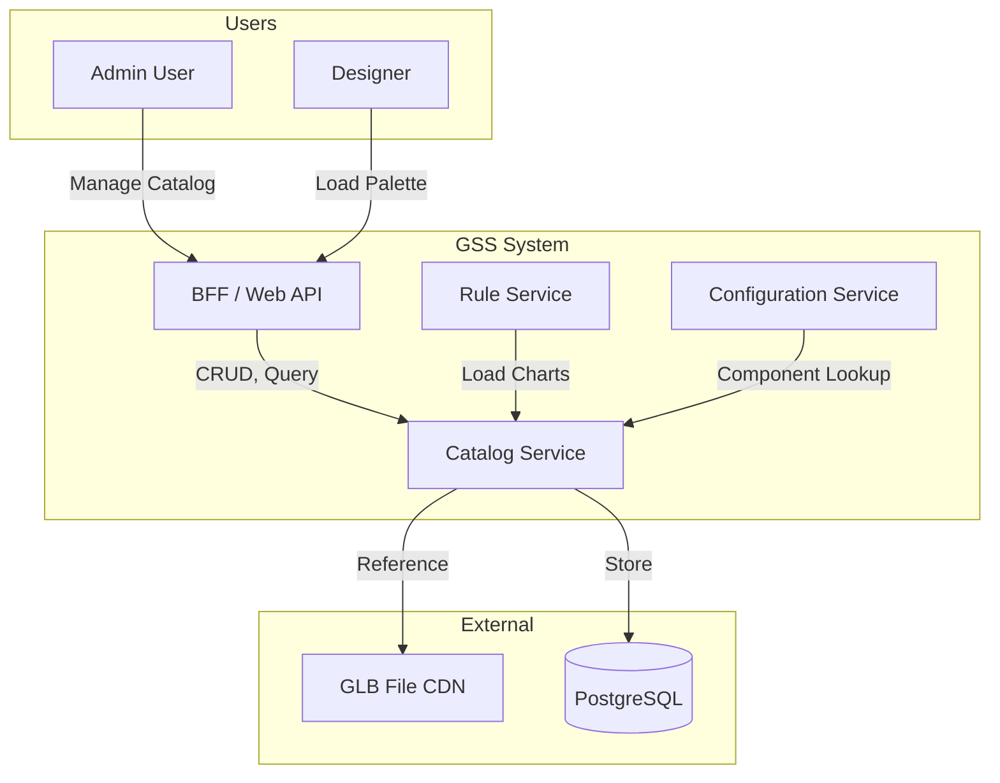

# Context Diagram

C4 Level 1: System Context diagram showing the Catalog Service and external actors/systems.

## External Systems

| System | Role | Integration |
|--------|------|-------------|
| BFF | API Gateway | REST API |
| Rule Service | Consumer | Sync API |
| Configuration Service | Consumer | Sync API |
| PostgreSQL | Persistence | Dapper + FluentMigrator |
| CDN | 3D Model Storage | URL reference |
