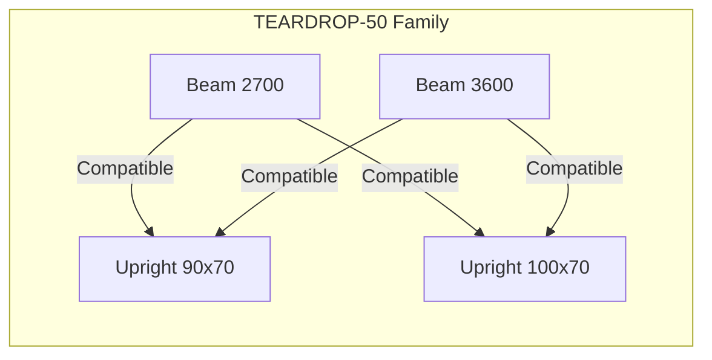

# Physical Interfaces & Compatibility

> **Level 2 Abstraction:** How components **physically connect**.

## Why Interfaces Matter

In real structures:
- A Beam can only connect to an Upright if their interface families match
- No interface match = no physical connection allowed

This prevents:
- Mixing incompatible systems
- Accidental use of wrong beam–upright combinations
- Loss of configuration control over time

---

## Interface-Socket Concept

Every component declares:

| Property | Description | Example |
|----------|-------------|---------|
| `connection_type` | Physical connection pattern | Teardrop-50, Bolt-On-Type-B |
| `interface_family` | Compatibility group | GSS-TEARDROP, GSS-BOLT |
| `role` | Plug or Socket | PLUG, SOCKET |

---

## Interface Families

| Family | Components | Connection Type |
|--------|------------|-----------------|
| TEARDROP-50 | Beam ↔ Upright | Hook-in teardrop slots |
| TEARDROP-75 | Heavy beam ↔ Upright | Larger teardrop pattern |
| BOLT-ON-A | Panel ↔ Beam | Bolt attachment |
| BASE-PLATE-M12 | Upright ↔ Anchor | M12 anchor pattern |

---

## Compatibility Matrix



---

## Validation Rule

Before any structural relationship is created:

```yaml
validation:
  - check: interface_family_match
    condition: beam.interface_family == upright.interface_family
    error: "Beam and Upright interface families do not match"
    
  - check: connection_type_compatible
    condition: beam.connection_type == upright.accepts_connection_type
    error: "Connection type incompatible"
```

---

## Interface Schema

```sql
CREATE TABLE component_interfaces (
    id UUID PRIMARY KEY,
    component_type_id UUID NOT NULL REFERENCES component_types(id),
    interface_family VARCHAR(50) NOT NULL,
    connection_type VARCHAR(100) NOT NULL,
    role VARCHAR(20) NOT NULL, -- PLUG, SOCKET, BOTH
    position VARCHAR(50), -- TOP, BOTTOM, LEFT, RIGHT, FRONT, BACK
    geometry JSONB, -- hole patterns, dimensions
    created_at TIMESTAMP NOT NULL
);

CREATE TABLE interface_compatibility (
    id UUID PRIMARY KEY,
    plug_interface_id UUID NOT NULL REFERENCES component_interfaces(id),
    socket_interface_id UUID NOT NULL REFERENCES component_interfaces(id),
    is_compatible BOOLEAN NOT NULL,
    notes TEXT
);
```

---

## Key Invariant

> **A structure that cannot physically connect is invalid, regardless of load capacity.**

---

## Related Documentation

- [Component Taxonomy](../README.md)
- [Structural Formation Order](../../05-assemblies/structural-formation-order.md)
