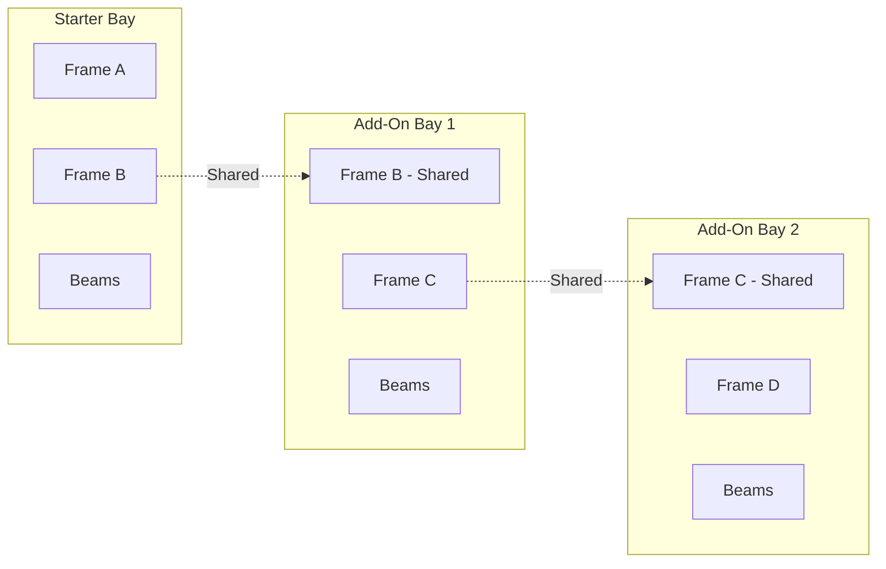

# Assemblies

> **Level 3 Abstraction:** How components behave in structure.

## What Are Assemblies?

Some structural behavior depends on **how components are assembled**.

Assemblies are **first-class physical concepts**:

| Assembly Type | Description |
|---------------|-------------|
| Starter Bay Assembly | Two independent frames + beams |
| Add-On Bay Assembly | Shares a frame with previous bay |
| Bracing Assembly | Stability system for frames |
| Safety Kit Assembly | Protection package |

---

## Why Assemblies Matter

| Concept | Starter Bay | Add-On Bay |
|---------|-------------|------------|
| Frames | 2 independent | 1 new + 1 shared |
| Load transfer | Independent | Coupled |
| Structural dependency | None | Requires Starter |

Assemblies allow correct handling of:
- Load transfer paths
- Shared frames
- Progressive bay expansion
- Structural dependency chains

---

## Assembly Types

### Bay Assemblies



### Frame Assembly

| Component | Qty | Description |
|-----------|-----|-------------|
| Upright | 2 | Vertical columns |
| Bracing | n | Diagonal/horizontal |
| Base Plate | 2 | Floor connection |
| Anchor Bolts | 4-8 | Slab attachment |

### Beam Level Assembly

| Component | Qty | Description |
|-----------|-----|-------------|
| Beam | 2 | Front and back |
| Connectors | 4 | Beam-to-upright |
| Lock Pins | 4 | Safety locks |

---

## Assembly Dependencies

| Assembly | Depends On | Reason |
|----------|------------|--------|
| Add-On Bay | Starter Bay | Shares frame |
| Beam Level | Frame | Requires uprights |
| Bracing | Frame | Stabilizes uprights |
| Safety Guard | Frame | Attaches to upright |

---

## Assembly Composition Template

Defines **what always exists** when an assembly is instantiated:

```json
{
  "assembly_type": "STARTER_BAY",
  "product_group": "SPR",
  "composition": [
    { "component_type": "FRAME", "quantity": 2, "mandatory": true },
    { "component_type": "BEAM_LEVEL", "quantity_formula": "levels", "mandatory": true },
    { "component_type": "BRACING", "quantity": 2, "conditional": "height > 5000" }
  ]
}
```

---

## Assembly Schema

```sql
CREATE TABLE assembly_types (
    id UUID PRIMARY KEY,
    code VARCHAR(50) UNIQUE NOT NULL,
    name VARCHAR(255) NOT NULL,
    product_group VARCHAR(50),
    composition_template JSONB NOT NULL,
    created_at TIMESTAMP NOT NULL
);

CREATE TABLE assembly_instances (
    id UUID PRIMARY KEY,
    assembly_type_id UUID NOT NULL REFERENCES assembly_types(id),
    system_instance_id UUID NOT NULL REFERENCES storage_system_instances(id),
    sequence_number INT,
    parent_assembly_id UUID REFERENCES assembly_instances(id),
    created_at TIMESTAMP NOT NULL
);
```

---

## Related Documentation

- [Structural Formation Order](./structural-formation-order.md)
- [Component Taxonomy](../03-component-taxonomy/README.md)
- [BOM Explosion](../07-bom/README.md)
