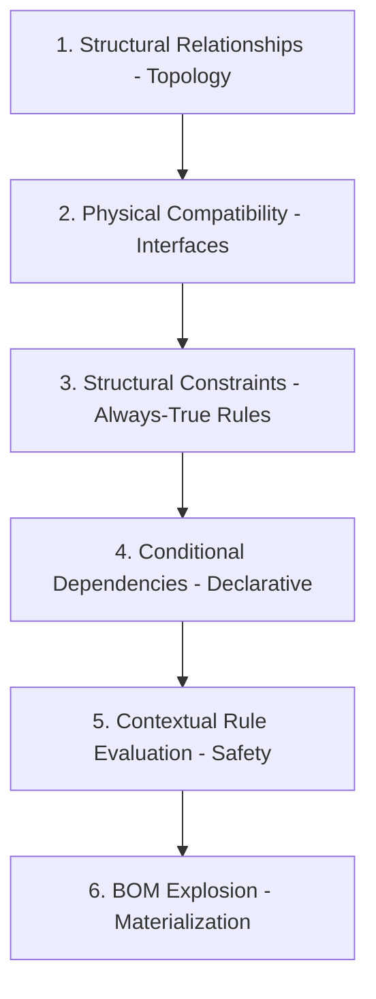

# Structural Formation Order

> **A system cannot be declared safe until its structure is correctly formed.**

## Why Order Matters

Warehouse storage systems are **physical structures governed by load paths and stability**, not abstract logical models.

> A system that violates this order may appear valid digitally but can be **physically unsafe or impossible to construct**.

---

## Mandatory Formation Sequence

Each step depends on the correctness of the previous step.

---

## Step 1 — Structural Relationships (Topology)

### Question: "What is connected to what?"

| Relationship | Description |
|--------------|-------------|
| Beams supported by Uprights | Load path |
| Bracing stabilizes Uprights | Stability |
| Base Plates connect to Floor | Foundation |
| Add-On Bays share Frame | Dependency |

> **Invariant:** If the structural relationship is incorrect, no amount of later validation can make the system safe.

---

## Step 2 — Physical Compatibility (Interfaces)

### Question: "Can these two components physically connect?"

| Check | Example |
|-------|---------|
| Interface family match | Beam TEARDROP-50 ↔ Upright TEARDROP-50 |
| Anchor diameter | M12 anchor fits M12 hole pattern |
| Panel width | Fits between beam spacing |

> **Invariant:** A structure that cannot physically connect is invalid, regardless of load capacity.

---

## Step 3 — Structural Constraints (Always-True)

### Question: "What must always exist for this system to be valid?"

| Constraint | Product Group |
|------------|---------------|
| Frames and Beams mandatory | SPR |
| Cantilever arms forbidden | SPR |
| Add-On requires Starter | All |
| Rails required | ASRS |

> **Invariant:** Structural constraints define *what the system is*, not how strong it is.

---

## Step 4 — Conditional Dependencies (Declarative)

### Question: "Under what conditions does this require additional elements?"

| Condition | Dependency |
|-----------|------------|
| Height > 5,000 mm | Bracing required |
| Seismic Zone ≥ 3 | Enhanced anchoring |
| Narrow aisle + Reach Truck | Safety guards |

At this stage, dependencies are **declared, not executed**.

> **Invariant:** Dependencies describe *possibility*, not enforcement.

---

## Step 5 — Contextual Rule Evaluation (Safety)

### Question: "Is this structure safe *in this specific context*?"

Evaluates:
- Warehouse spatial context (area, floor, slab)
- Load charts
- Span and height calculations
- MHE selection
- Aisle width

> **Invariant:** Safety cannot be evaluated without complete structural context.

---

## Step 6 — BOM Explosion (Materialization)

Only after all prior steps are validated:

1. Expand assemblies into components
2. Add mandatory safety and stability items
3. Resolve quantities
4. Generate BOMs

> **Invariant:** BOM is a *result* of engineering decisions, not an input.

---

## Violation Risks

Violating this order leads to:

| Risk | Description |
|------|-------------|
| Incorrect load paths | Structure may not stand |
| Missing stability elements | Collapse risk |
| Physically impossible assemblies | Cannot be built |
| Site-level rework | Costly corrections |
| Safety non-compliance | Legal liability |

---

## Related Documentation

- [Assemblies](./README.md)
- [BOM Explosion](../07-bom/README.md)
- [Component Taxonomy](../03-component-taxonomy/README.md)
