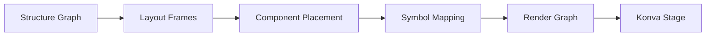

# 2D Symbols

> **UI renders a View Model derived from the validated Structure Graph. UI never becomes the source of truth.**

## What Are Symbols?

Each taxonomy component has a **2D symbol definition** for rendering:
- Top view (layout planning)
- Front view (elevation)
- Side view (depth)

---

## Symbol Definition Structure

```json
{
  "symbol_id": "SYM-BEAM-2700",
  "component_type_id": "BEAM",
  "views": {
    "TOP": {
      "geometry_template": "rect",
      "width_param": "bay_width",
      "height_param": "beam_depth",
      "anchor_points": ["left", "right"]
    },
    "FRONT": {
      "geometry_template": "rect",
      "width_param": "bay_width",
      "height_param": "beam_face_height"
    }
  },
  "default_style": {
    "stroke": "#333333",
    "fill": "#C0C0C0",
    "stroke_width": 1
  }
}
```

---

## Symbol Types by Component

| Component Type | Top View | Front View | Symbol |
|----------------|----------|------------|--------|
| Upright | Small rect | Tall rect | Column cross-section |
| Beam | Line/rect | Rect | Beam span |
| Bracing | Line | Diagonal | X-pattern |
| Base Plate | Square | Line | Foundation |
| Safety Guard | Polyline | Rect | Aisle edge |
| Panel | Rect | Thin rect | Deck surface |

---

## Parametric Symbols

Symbols are **parametric** — dimensions come from component attributes:

| Parameter | Source | Used For |
|-----------|--------|----------|
| `bay_width` | Assembly fact | Beam length |
| `frame_depth` | Component attribute | Upright depth |
| `beam_height` | Derived value | Y-position |
| `aisle_width` | Context fact | Aisle spacing |

---

## Symbol Rendering Pipeline



1. **Structure Graph** — Validated assemblies + components
2. **Layout Frames** — Positions for frames and bays
3. **Component Placement** — Transform for each component
4. **Symbol Mapping** — Component type → Symbol definition
5. **Render Graph** — Konva Groups with shapes
6. **Konva Stage** — Visual output

---

## Konva Layer Structure

```
Stage (viewport)
├── Layer: Civil/Floorplan
├── Layer: Constraints (pillars, doors)
├── Layer: Systems
│   ├── Group: SystemInstance
│   │   ├── Group: Assembly
│   │   │   └── Group: Component (symbol)
├── Layer: Annotations
├── Layer: Validation Overlay
└── Layer: Interaction
```

---

## Symbol Schema

```sql
CREATE TABLE symbol_definitions (
    id UUID PRIMARY KEY,
    component_type_id UUID NOT NULL REFERENCES component_types(id),
    view VARCHAR(20) NOT NULL, -- TOP, FRONT, SIDE
    geometry_template VARCHAR(50) NOT NULL,
    parameters JSONB,
    anchor_points JSONB,
    default_style JSONB,
    created_at TIMESTAMP NOT NULL,
    UNIQUE(component_type_id, view)
);
```

---

## Key Principle

> **UI edits parameters, not geometry.**  
> Geometry is always a projection of the validated structure.

---

## Related Documentation

- [Component Taxonomy](../03-component-taxonomy/README.md)
- [Assemblies](../05-assemblies/README.md)
