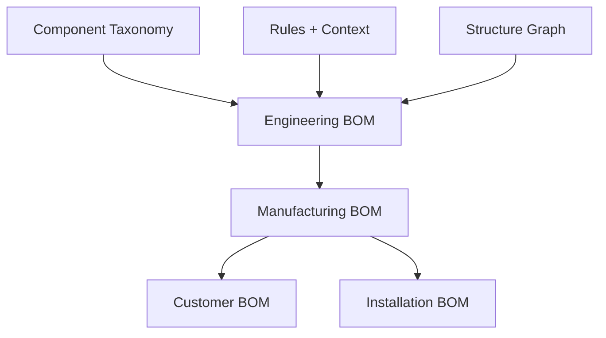

# BOM Explosion

> **Principle:** BOM is **derived**, never manually assembled.

## What Is BOM Explosion?

BOM Explosion is the process of converting a validated structure into **material quantities**.



---

## BOM Types

| BOM Type | Purpose | Contains |
|----------|---------|----------|
| **Engineering BOM** | Logical components | Component types, quantities |
| **Manufacturing BOM** | SKU-resolved | Actual part numbers |
| **Customer BOM** | Commercial view | Priced line items |
| **Installation BOM** | Site execution | Grouped by location |

---

## BOM Generation Flow

### Step 1 — Layout Produces Component Instances

User places rack → Assemblies expand:
- Uprights
- Beams
- Base plates
- Anchors

### Step 2 — Taxonomy Defines Composition

Each assembly has a **base composition template**:

```json
{
  "assembly": "BEAM_LEVEL",
  "composition": [
    { "type": "BEAM", "qty": 2 },
    { "type": "BEAM_CONNECTOR", "qty": 4 },
    { "type": "LOCK_PIN", "qty": 4 }
  ]
}
```

### Step 3 — Rules Add Mandatory Items

Contextual rules add:
- Bracing (if height > 5m)
- Seismic anchors (if zone ≥ 3)
- Safety guards (if narrow aisle)

### Step 4 — Variant Resolution

Catalog resolves logical components to SKUs:

| Engineering BOM | Manufacturing BOM |
|-----------------|-------------------|
| Beam (2700, ≥2500kg) | GSS-BM-2700-1.6-SB |
| Anchor (Class C) | VendorX-ANCH-C-M12 |
| Upright (10500) | GSS-UP-10500-90x70 |

### Step 5 — Customer BOM

Final priced BOM ready for quotation:

| Item | Qty | Unit Price | Total |
|------|-----|------------|-------|
| GSS-BM-2700-1.6-SB | 24 | ₹1,200 | ₹28,800 |
| GSS-UP-10500-90x70 | 4 | ₹3,500 | ₹14,000 |

---

## BOM Explosion Example

**1 Beam Instance →**
- Beam × 1
- Beam Connectors × 2
- Lock Pins × 4

**1 Upright Instance →**
- Upright × 1
- Base Plate × 1
- Anchor Bolts × 2-4
- Shims (if required by slab tolerance)

---

## BOM Aggregation Hierarchy

```
Warehouse-Level BOM
├── Per Area Aggregation
│   ├── Safety infrastructure
│   └── Zone-specific accessories
├── Per Floor Aggregation
│   ├── Floor-specific civil items
│   └── Consolidated BOMs
└── Per System Instance
    ├── Assemblies expanded
    ├── Mandatory dependencies
    └── Local BOM
```

---

## BOM Schema

```sql
CREATE TABLE bom_items (
    id UUID PRIMARY KEY,
    bom_id UUID NOT NULL REFERENCES boms(id),
    component_type_id UUID NOT NULL REFERENCES component_types(id),
    sku_id UUID REFERENCES skus(id),
    quantity DECIMAL NOT NULL,
    unit VARCHAR(20) DEFAULT 'EA',
    source_assembly_id UUID,
    source_rule_id UUID,
    notes TEXT,
    created_at TIMESTAMP NOT NULL
);

CREATE TABLE boms (
    id UUID PRIMARY KEY,
    bom_type VARCHAR(50) NOT NULL, -- ENGINEERING, MANUFACTURING, CUSTOMER, INSTALLATION
    system_instance_id UUID NOT NULL,
    version INT NOT NULL,
    status VARCHAR(20) NOT NULL,
    created_at TIMESTAMP NOT NULL
);
```

---

## Key Invariants

| Invariant | Description |
|-----------|-------------|
| No missing hardware | All connectors, pins included |
| No over-counting | Shared components counted once |
| Structural completeness | All mandatory items present |
| Full traceability | Source (assembly, rule) recorded |

---

## Related Documentation

- [Structural Formation Order](../05-assemblies/structural-formation-order.md)
- [Component Taxonomy](../03-component-taxonomy/README.md)
- [SKU Management](../09-api/sku-apis.md)
