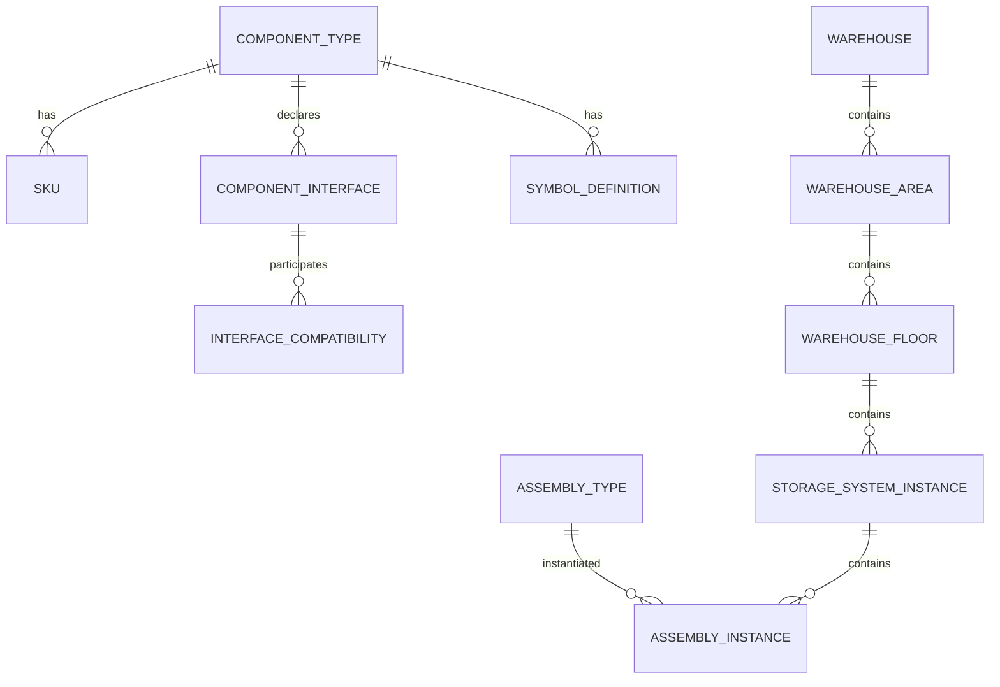

# Data Model Schema

Database schema for the Catalog Service.

## Overview

The Catalog Service manages:
- **Component Taxonomy** — What components exist
- **Physical Interfaces** — How components connect
- **Assemblies** — Structural groupings
- **SKUs** — Sellable product items
- **Warehouse Spatial Context** — Where components exist
- **2D Symbols** — Visual representations

---

## Core Tables

### Component Types (Taxonomy)

```sql
CREATE TABLE component_types (
    id UUID PRIMARY KEY,
    code VARCHAR(50) UNIQUE NOT NULL,
    name VARCHAR(255) NOT NULL,
    category VARCHAR(100) NOT NULL,
    parent_type_id UUID REFERENCES component_types(id),
    attributes JSONB,
    is_active BOOLEAN DEFAULT true,
    created_at TIMESTAMP NOT NULL,
    created_by VARCHAR(255)
);

CREATE INDEX idx_component_types_category ON component_types(category);
CREATE INDEX idx_component_types_parent ON component_types(parent_type_id);
```

### Component Interfaces

```sql
CREATE TABLE component_interfaces (
    id UUID PRIMARY KEY,
    component_type_id UUID NOT NULL REFERENCES component_types(id),
    interface_family VARCHAR(50) NOT NULL,
    connection_type VARCHAR(100) NOT NULL,
    role VARCHAR(20) NOT NULL, -- PLUG, SOCKET, BOTH
    position VARCHAR(50),
    geometry JSONB,
    created_at TIMESTAMP NOT NULL
);

CREATE TABLE interface_compatibility (
    id UUID PRIMARY KEY,
    plug_interface_id UUID NOT NULL REFERENCES component_interfaces(id),
    socket_interface_id UUID NOT NULL REFERENCES component_interfaces(id),
    is_compatible BOOLEAN NOT NULL,
    notes TEXT
);
```

### SKUs

```sql
CREATE TABLE skus (
    id UUID PRIMARY KEY,
    code VARCHAR(100) UNIQUE NOT NULL,
    name VARCHAR(255) NOT NULL,
    component_type_id UUID REFERENCES component_types(id),
    glb_file VARCHAR(500),
    attributes JSONB,
    is_active BOOLEAN DEFAULT true,
    is_deleted BOOLEAN DEFAULT false,
    created_at TIMESTAMP NOT NULL,
    created_by VARCHAR(255),
    updated_at TIMESTAMP,
    updated_by VARCHAR(255)
);

CREATE INDEX idx_skus_code ON skus(code);
CREATE INDEX idx_skus_component_type ON skus(component_type_id);
CREATE INDEX idx_skus_is_deleted ON skus(is_deleted);
```

### Pallets

```sql
CREATE TABLE pallets (
    id UUID PRIMARY KEY,
    code VARCHAR(100) UNIQUE NOT NULL,
    name VARCHAR(255) NOT NULL,
    pallet_type VARCHAR(50),
    width_mm DECIMAL,
    depth_mm DECIMAL,
    height_mm DECIMAL,
    max_weight_kg DECIMAL,
    is_active BOOLEAN DEFAULT true,
    is_deleted BOOLEAN DEFAULT false,
    created_at TIMESTAMP NOT NULL
);
```

### MHE (Material Handling Equipment)

```sql
CREATE TABLE mhes (
    id UUID PRIMARY KEY,
    code VARCHAR(100) UNIQUE NOT NULL,
    name VARCHAR(255) NOT NULL,
    equipment_type VARCHAR(50),
    max_lift_height_mm DECIMAL,
    min_aisle_width_mm DECIMAL,
    max_load_kg DECIMAL,
    is_active BOOLEAN DEFAULT true,
    is_deleted BOOLEAN DEFAULT false,
    created_at TIMESTAMP NOT NULL
);
```

---

## Warehouse Spatial Tables

```sql
CREATE TABLE warehouses (
    id UUID PRIMARY KEY,
    name VARCHAR(255) NOT NULL,
    location VARCHAR(255),
    design_standard VARCHAR(50),
    currency VARCHAR(3),
    created_at TIMESTAMP NOT NULL
);

CREATE TABLE warehouse_areas (
    id UUID PRIMARY KEY,
    warehouse_id UUID NOT NULL REFERENCES warehouses(id),
    name VARCHAR(255) NOT NULL,
    zone_type VARCHAR(100),
    fire_zone VARCHAR(50),
    permitted_mhe_types JSONB,
    created_at TIMESTAMP NOT NULL
);

CREATE TABLE warehouse_floors (
    id UUID PRIMARY KEY,
    area_id UUID NOT NULL REFERENCES warehouse_areas(id),
    floor_number INT NOT NULL,
    clear_height_mm DECIMAL NOT NULL,
    slab_rating_kn_m2 DECIMAL,
    seismic_zone VARCHAR(20),
    created_at TIMESTAMP NOT NULL
);

CREATE TABLE storage_system_instances (
    id UUID PRIMARY KEY,
    floor_id UUID NOT NULL REFERENCES warehouse_floors(id),
    product_group VARCHAR(50) NOT NULL,
    ruleset_version VARCHAR(20),
    mhe_type VARCHAR(50),
    aisle_width_mm DECIMAL,
    created_at TIMESTAMP NOT NULL
);
```

---

## Assembly Tables

```sql
CREATE TABLE assembly_types (
    id UUID PRIMARY KEY,
    code VARCHAR(50) UNIQUE NOT NULL,
    name VARCHAR(255) NOT NULL,
    product_group VARCHAR(50),
    composition_template JSONB NOT NULL,
    created_at TIMESTAMP NOT NULL
);

CREATE TABLE assembly_instances (
    id UUID PRIMARY KEY,
    assembly_type_id UUID NOT NULL REFERENCES assembly_types(id),
    system_instance_id UUID NOT NULL REFERENCES storage_system_instances(id),
    sequence_number INT,
    parent_assembly_id UUID REFERENCES assembly_instances(id),
    transform JSONB,
    created_at TIMESTAMP NOT NULL
);
```

---

## Symbol Tables

```sql
CREATE TABLE symbol_definitions (
    id UUID PRIMARY KEY,
    component_type_id UUID NOT NULL REFERENCES component_types(id),
    view VARCHAR(20) NOT NULL, -- TOP, FRONT, SIDE
    geometry_template VARCHAR(50) NOT NULL,
    parameters JSONB,
    anchor_points JSONB,
    default_style JSONB,
    created_at TIMESTAMP NOT NULL,
    UNIQUE(component_type_id, view)
);
```

---

## Entity Relationships


