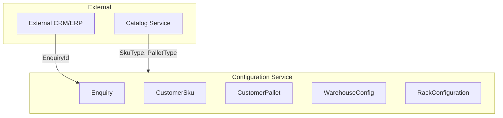

# Scope

## What Configuration Service Manages

## Entity Boundaries

| Entity | Responsibility | Key Attributes |
|--------|----------------|----------------|
| **Enquiry** | Project container | ExternalEnquiryId, Name, Status |
| **CustomerSku** | Customer's product specs | SkuTypeId, Dimensions, Weight |
| **CustomerPallet** | Customer's pallet specs | PalletTypeId, LoadCapacity |
| **WarehouseConfig** | Building context | Dimensions, ClearHeight, Constraints |
| **RackConfiguration** | Design output | ProductGroup, Layout, Levels |

## Integration Scope

### Receives Data From

- **External CRM/ERP** — Enquiry ID, customer details
- **Catalog Service** — SkuType, PalletType references

### Provides Data To

- **Rule Service** — Configuration state for validation
- **BOM Service** — RackConfiguration for BOM generation
- **BFF** — API for design UI

## Feature Matrix

| Feature | Enquiry | CustomerSku | CustomerPallet | WarehouseConfig | RackConfig |
|---------|---------|-------------|----------------|-----------------|------------|
| CRUD | ✅ | ✅ | ✅ | ✅ | ✅ |
| Version History | ✅ | ❌ | ❌ | ❌ | ❌ |
| Snapshots | ✅ | ❌ | ❌ | ❌ | ❌ |
| Soft Delete | ✅ | ✅ | ✅ | ✅ | ✅ |
