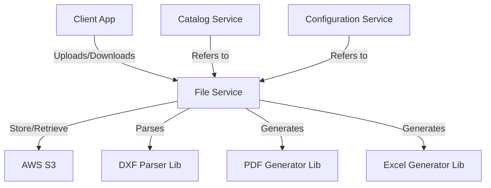

# Architecture & Context

The `file-service` interacts with several other services and external components.

## Context Diagram

## Key Components

- **API Layer:** Exposes endpoints for upload, download, and processing triggers.
- **Handlers:** Implements business logic for specific file operations (e.g., `ImportDxfHandler`).
- **Storage Provider:** Abstraction over S3 (or local storage for dev).
- **Processors:** Dedicated logic for parsing specific formats (DXF) or generating outputs (PDF/Excel).
