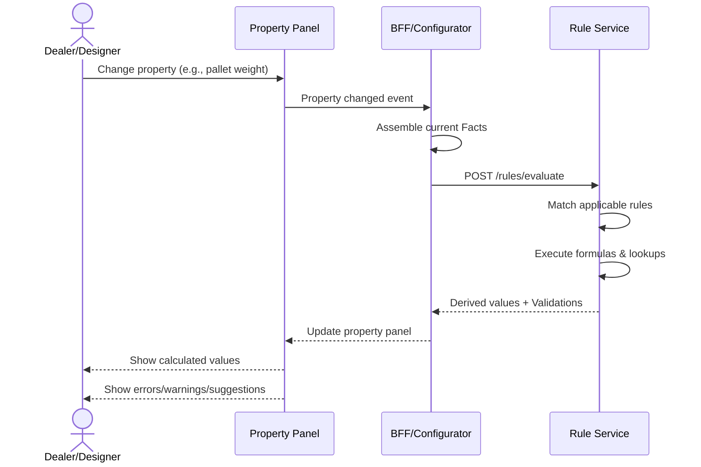

# Rule Service User Journeys

This document describes the key user journeys specific to the Rule Service.

## Journey Overview

| # | Journey | Actor | Frequency | Priority |
|---|---------|-------|-----------|----------|
| 1 | [Configure Warehouse](#1-configure-warehouse--real-time-validation) | **Dealer / Designer** | Every change | 🔴 Primary |
| 2 | [Author a Ruleset](#2-author-a-ruleset) | Engineering Admin | Weekly | Admin |
| 3 | [Validate & Activate](#3-validate--activate-ruleset) | Release Manager | Weekly | Admin |
| 4 | [Explain a Decision](#4-explain-a-decision) | Designer/Auditor | On-demand | Support |
| 5 | [Rollback a Ruleset](#5-rollback-a-ruleset) | Admin | Emergency | Admin |
| 6 | [Evolve Rules](#6-evolve-rules-new-version) | Engineering Team | Continuous | Admin |

---

## 1. Configure Warehouse — Real-time Validation

> **This is the primary user journey.** The Rule Service exists to support this experience.

| Aspect | Details |
|--------|---------|
| **Actor** | Dealer / Designer / Sales Consultant |
| **Goal** | Configure a warehouse with instant validation and guidance |
| **Trigger** | User changes any property in the configuration |

### User Experience Flow



### What the User Sees

| Feedback Type | UI Behavior | Example |
|---------------|-------------|---------|
| **Derived Value** | Auto-populated, locked field | Rack Height = 7200mm |
| **ERROR** | Red border, blocked progression | "Beam capacity exceeded" |
| **WARNING** | Yellow indicator, actionable | "Add row spacers for stability" |
| **INFO** | Tooltip / hint | "Optimal aisle width for reach truck is 2700mm" |

### Property Change → Rule Trigger Examples

| Property Changed | Rules Triggered | Possible Outputs |
|------------------|-----------------|------------------|
| Pallet Weight | Beam selection, Load validation | New beam type, Capacity warning |
| Pallet Height | Rack height calc, Level spacing | Derived rack height |
| MHE Type | Aisle validation, Lift height check | Aisle error, Level limit |
| Number of Levels | Height validation, Stability rules | Height derived, Stability warning |
| Frame Depth | Pallet overhang check | Error if overhang exceeded |

### Real-time Validation Requirements

| Requirement | Target |
|-------------|--------|
| Latency | < 100ms per property change |
| Feedback | Inline, contextual |
| Blocking | Only ERRORs block progression |
| Suggestions | Actionable with one-click apply |

### How the BFF Assembles Facts

```json
{
  "productGroup": "SPR",
  "phase": "CONFIGURE",
  "facts": {
    "warehouse": { "clearHeight": 10000, "seismicZone": "low" },
    "rack": { "type": "selectivePallet", "levels": 4, "frameDepth": 1100 },
    "pallet": { "width": 1000, "depth": 1200, "height": 1500, "weight": 1200 },
    "mhe": { "type": "reachTruck", "maxLiftHeight": 8000, "aisleWidth": 2700 },
    "configuration": { "topClearance": 150, "bottomClearance": 100 }
  }
}
```

### Response to the User

```json
{
  "success": true,
  "derivedValues": { "rackHeight": 7200, "beamType": "2700-3000" },
  "violations": [],
  "warnings": [
    {
      "code": "STABILITY_REQUIRED",
      "message": "Height/depth ratio exceeds 6:1. Add row spacers.",
      "field": "levels",
      "suggestion": { "action": "ADD_COMPONENT", "component": "row-spacer" }
    }
  ]
}
```

### Error Scenarios

| Scenario | User Feedback | Recovery |
|----------|---------------|----------|
| Beam capacity exceeded | "Pallet weight exceeds beam capacity (max 2000kg)" | Reduce weight or change beam |
| Aisle too narrow | "Aisle 2000mm insufficient for reach truck (min 2700mm)" | Widen aisle or change MHE |
| Rack exceeds building | "Rack height 9000mm exceeds clear height 8000mm" | Reduce levels |

---

## 2. Author a Ruleset

| Aspect | Details |
|--------|---------|
| **Actor** | Engineering Admin / Structural SME |
| **Goal** | Capture engineering knowledge as executable rules |

### Steps

1. **Create Ruleset** — Define name, product group, country
2. **Add Rules** — Create rules with conditions, actions, severity
3. **Add Formulas** — Define calculation expressions
4. **Add Lookups** — Import engineering tables
5. **Test Draft** — Run test evaluations
6. **Submit for Review** — Mark ready for validation

### API Endpoints

| Method | Endpoint | Purpose |
|--------|----------|---------|
| POST | `/admin/rulesets` | Create ruleset |
| POST | `/admin/rulesets/{id}/rules` | Add rule |
| POST | `/admin/formulas` | Create formula |
| POST | `/admin/lookups` | Create lookup |

---

## 3. Validate & Activate Ruleset

| Aspect | Details |
|--------|---------|
| **Actor** | Release Manager / Technical Lead |
| **Goal** | Safely deploy rules to production |

### Steps

1. **Trigger Validation** — Run structural, semantic, sanity checks
2. **Review Results** — Check for errors or warnings
3. **Approve** — Provide approval with comments
4. **Schedule Activation** — Set effective date/time
5. **Monitor** — Watch for issues post-activation

### API Endpoints

| Method | Endpoint | Purpose |
|--------|----------|---------|
| POST | `/admin/rulesets/{id}/validate` | Run validation |
| POST | `/admin/rulesets/{id}/approve` | Approve ruleset |
| POST | `/admin/rulesets/{id}/activate` | Activate immediately |

---

## 4. Explain a Decision

| Aspect | Details |
|--------|---------|
| **Actor** | Designer / Auditor / Support |
| **Goal** | Understand why a rule fired or value was computed |

### Steps

1. **Submit Facts** — Same as evaluate, with explain flag
2. **Review Trace** — See which rules fired, in what order
3. **Inspect Formulas** — View formula inputs and outputs
4. **Check Lookups** — See which rows matched

### API Endpoints

| Method | Endpoint | Purpose |
|--------|----------|---------|
| POST | `/rules/explain` | Evaluate with explanation |

### Response Structure

```json
{
  "traceId": "abc123",
  "evaluationPath": [
    { "step": 1, "type": "RULE", "ruleId": "elev-001", "result": true },
    { "step": 2, "type": "FORMULA", "formulaId": "rack-height", "output": 7200 }
  ]
}
```

---

## 5. Rollback a Ruleset

| Aspect | Details |
|--------|---------|
| **Actor** | Admin / Release Manager |
| **Goal** | Revert to a previous ruleset version |

### Steps

1. **Identify Issue** — Monitor alerts, error rates
2. **Determine Target** — Pick stable version
3. **Execute Rollback** — Call rollback API with reason
4. **Verify** — Check evaluations returning correct results
5. **Post-Mortem** — Document root cause

### API Endpoints

| Method | Endpoint | Purpose |
|--------|----------|---------|
| POST | `/admin/rulesets/{id}/rollback` | Execute rollback |
| GET | `/admin/rulesets/{id}/versions` | List all versions |

---

## 6. Evolve Rules (New Version)

| Aspect | Details |
|--------|---------|
| **Actor** | Engineering Team |
| **Goal** | Add/modify rules without breaking existing behavior |

### Steps

1. **Clone Version** — Create new version from current active
2. **Modify** — Add/update rules, formulas, lookups
3. **Test** — Run test evaluations, compare with previous
4. **Review** — Peer review changes
5. **Activate** — Follow activation journey

### API Endpoints

| Method | Endpoint | Purpose |
|--------|----------|---------|
| POST | `/admin/rulesets/{id}/clone` | Clone to new version |
| GET | `/admin/rulesets/{id}/diff` | Compare versions |

---

## Cross-Reference: System Journeys

| System Journey | Rule Service Role |
|----------------|-------------------|
| [Create Configuration](../../../docs/User_Journeys/02_Create_Configuration_From_Enquiry.md) | Real-time validation |
| [Update Configuration](../../../docs/User_Journeys/03_Update_Configuration.md) | Incremental validation |
| [Generate BOM](../../../docs/User_Journeys/07_Generate_BOM.md) | BOM-specific rules |
