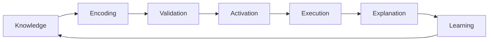
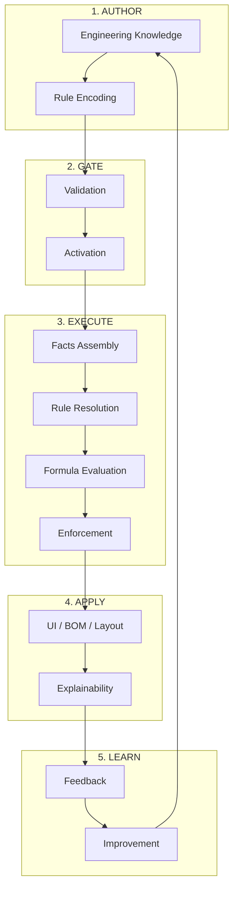

# End-to-End Rule Lifecycle

> **Engineering View** — This document describes the lifecycle from an architectural reasoning perspective, not UI flow.

## Lifecycle Overview

The lifecycle is a **closed loop**:



Each stage includes:
- **Who** — Responsible party
- **Intent** — Why this stage exists
- **What Happens** — Core activities
- **Invariant** — What must never break

---

## 1. Rule Authoring

| Aspect | Details |
|--------|---------|
| **Who** | Engineering Admin / Structural SME *(not a developer)* |
| **Intent** | Capture engineering knowledge in machine-executable, human-verifiable form |

### Assets Created

| Asset | Purpose | Examples |
|-------|---------|----------|
| **Ruleset** | Container | Product Group, Country, Effective dates, Version |
| **Rules** | Logic triggers | Phase, Applicability, Severity, Action type |
| **Formulas** | Math expressions | Variables, Units (mm, kg) |
| **Lookups** | Engineering tables | Beam capacity, Clearance matrix |

> [!IMPORTANT]
> **Invariant:** Rules do not contain math or tables — they *reference* formulas and lookups. This separation keeps the system generic, scalable, and maintainable.

---

## 2. Rule Validation

| Aspect | Details |
|--------|---------|
| **Who** | Rules Service (automated) + Optional human reviewer |
| **Intent** | Ensure rules cannot break production or violate engineering logic |

### Validation Layers

| Layer | Checks |
|-------|--------|
| **Structural** | JSON schema valid, Referenced formulas/lookups exist |
| **Semantic** | Expressions parse, Variables exist in Facts schema, Units compatible |
| **Sanity** | No circular derivations, No conflicting ERRORs in same phase |

> [!IMPORTANT]
> **Invariant:** A ruleset cannot be activated unless internally consistent. This prevents runtime crashes and silent engineering errors.

---

## 3. Rule Activation

| Aspect | Details |
|--------|---------|
| **Who** | Admin / Release Manager |
| **Intent** | Make engineering knowledge live without code deployment |

### Activation Scope

- Product Group
- Country
- Phase
- Effective date range

Old rulesets remain **immutable and archived**.

> [!IMPORTANT]
> **Invariant:** Only one active ruleset per `(productGroup, country, phase)` at any time. Enables safe rollback, auditability, and parallel standards (EU vs IN).

---

## 4. Runtime Evaluation

This is where the **Configurator consumes rules**. It has three sub-phases:

### 4.1 Facts Assembly

| Aspect | Details |
|--------|---------|
| **Who** | Configurator Service / BFF |
| **Intent** | Provide complete, normalized engineering context |

The BFF constructs a **Facts Envelope**:

| Domain | Facts Included |
|--------|----------------|
| Warehouse | Clear height, Doors, Pillars |
| Rack | Type, Depth, Levels |
| SKU | Dimensions, Weight, Stackability |
| Pallet | Dimensions, Load, Overhang |
| MHE | Working height, Aisle width, Load capacity |
| Config | Clearances, Pitch, Rounding rules |

> [!IMPORTANT]
> **Invariant:** The Rules Service never queries databases — it evaluates only facts. This makes the engine deterministic, cacheable, testable, and simulation-ready.

---

### 4.2 Rule Resolution

| Aspect | Details |
|--------|---------|
| **Who** | Rules Engine |
| **Intent** | Run only relevant rules in correct order |

**Resolution Steps:**
1. Identify active ruleset
2. Filter rules using `appliesWhen`
3. Sort by **phase + execution order**

> [!IMPORTANT]
> **Invariant:** Rules are evaluated by phase, never arbitrarily. Prevents validating before deriving, or placing racks before checking MHE.

---

### 4.3 Variable Evaluation

| Aspect | Details |
|--------|---------|
| **Who** | Formula Engine + Lookup Resolver |
| **Intent** | Convert engineering math into computed, traceable facts |

**Example: Rack Height**
```
1. Evaluate: civilLimit, mheLimit
2. Apply: rackHeight = MIN(civilLimit, mheLimit)
3. Emit: derived fact → rackHeight
```

**Example: Beam Selection**
```
1. Lookup: beam-capacity-matrix
2. Match: beamType, requiredLoad
3. Select: first capacity ≥ required load
```

> [!IMPORTANT]
> **Invariant:** Derived values become new facts but are read-only. Enables chained derivations and predictable behavior.

---

## 5. Rule Enforcement

| Aspect | Details |
|--------|---------|
| **Who** | Rules Engine |
| **Intent** | Protect engineering invariants |

### Outcome Types

| Severity | Behavior | Example |
|----------|----------|---------|
| **ERROR** | Blocks progression | Beam capacity < pallet load |
| **WARN** | Suggests components | Height/depth > 6 → add stability |
| **INFO** | Contextual hints | No blocking |

> [!IMPORTANT]
> **Invariant:** Rules do not change user data — they only evaluate and advise. Critical for user trust.

---

## 6. Application of Results

| Aspect | Details |
|--------|---------|
| **Who** | Configurator UI, BOM Service, Layout Engine |
| **Intent** | Apply rule outputs to downstream systems |

| Result Type | Action |
|-------------|--------|
| **Derived Values** | Auto-populate and lock calculated fields |
| **Violations** | Display inline, prevent export/progression |
| **Recommendations** | Optionally accepted (tie rods, row guards) |

> [!IMPORTANT]
> **Invariant:** Rules Service decides → UI renders → BOM consumes. No business logic leaks into UI.

---

## 7. Explainability & Audit

| Aspect | Details |
|--------|---------|
| **Who** | Designers, Reviewers, Auditors |
| **Intent** | Answer: *"Why did the system do this?"* |

### Recorded Per Evaluation

- Rule IDs fired
- Inputs used
- Formula steps
- Lookup rows selected
- Final results

Accessible via: `POST /rules/explain`

> [!IMPORTANT]
> **Invariant:** Every decision is replayable and traceable. This is what makes the system engineering-grade.

---

## 8. Feedback & Evolution

| Aspect | Details |
|--------|---------|
| **Who** | Engineering teams, Product owners |
| **Intent** | Improve rules without fear |

### Evolution Process

1. Analyze violations and edge cases
2. Introduce new rules as **new versions**
3. Existing rules remain preserved and immutable

> [!IMPORTANT]
> **Invariant:** Rules evolve by addition and versioning, never mutation.

---

## Lifecycle Summary



---

## Key Takeaway

> **Rules are not code. They are institutional engineering knowledge.**

This lifecycle ensures:

| Principle | How |
|-----------|-----|
| **Knowledge is explicit** | Captured in rules, formulas, lookups |
| **Decisions are deterministic** | Facts-only evaluation |
| **Change is safe** | Immutable versioning |
| **Scale is natural** | Separation of concerns |
