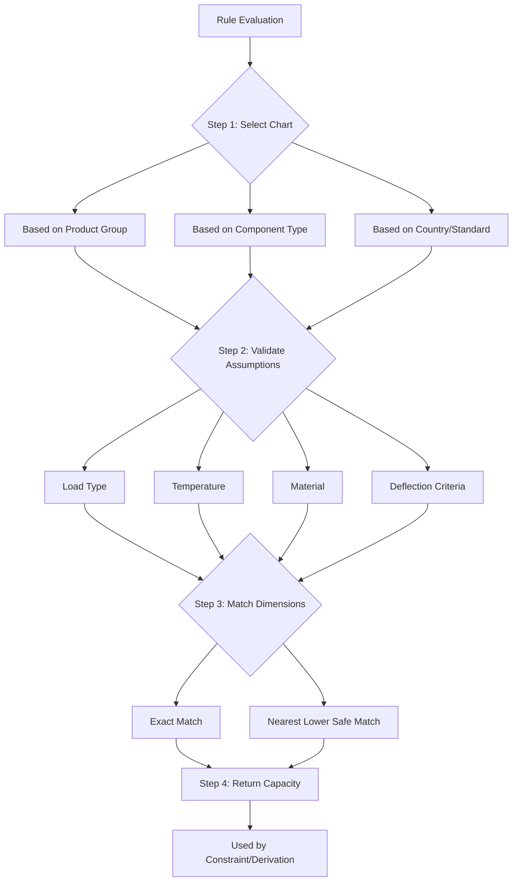

# Load Charts — Universal Model

> **Core Principle:** Load charts belong to **structural components**, not product groups. Product groups **use**, **restrict**, or **combine** load charts — they do not own them.

## Abstraction Hierarchy

```
Product Group (SPR, Cantilever, ASRS, Mobile, Shelving…)
   └── Configuration Rules
          └── Structural Components
                 └── Load Charts
```

**Key insight:** Different components, different load charts, **same engine**.

---

## What Is a Load Chart?

A load chart answers **one question**:

> "Given these physical parameters and assumptions, what load is allowed?"

Load charts are:
- **Engineering references**, not business rules
- **Component-specific**, not product-group-specific
- **Immutable once active** — append-only, versioned

---

## Universal Load Chart Data Model

### Metadata Entity

The chart metadata is **product-group agnostic**:

| Field | Meaning | Example |
|-------|---------|---------|
| `chart_code` | Unique engineering identifier | `STEP_BEAM_RF_V2` |
| `component_type` | Structural category | BEAM, ARM, PANEL, RAIL |
| `component_subtype` | Specific variant | STEP_BEAM, CANT_ARM |
| `material_spec` | Steel grade | S355, S275 |
| `load_type` | Loading pattern | UDL, POINT |
| `deflection_limit` | Engineering criteria | L/200, L/180 |
| `temperature_min` | Minimum rated temp | -20°C |
| `assumptions` | Engineering notes | Text |
| `effective_from` | Activation date | 2026-01-01 |
| `version` | Immutable version | 1, 2, 3 |
| `status` | Lifecycle state | ACTIVE, ARCHIVED |

```sql
CREATE TABLE load_chart (
    id UUID PRIMARY KEY,
    chart_code VARCHAR(50) UNIQUE NOT NULL,
    component_type VARCHAR(50) NOT NULL,
    component_subtype VARCHAR(50),
    material_spec VARCHAR(50),
    load_type VARCHAR(20),
    deflection_limit VARCHAR(20),
    temperature_min DECIMAL,
    assumptions TEXT,
    effective_from DATE NOT NULL,
    version INT NOT NULL,
    status VARCHAR(20) NOT NULL DEFAULT 'DRAFT',
    created_at TIMESTAMP NOT NULL,
    created_by VARCHAR(255)
);
```

> [!IMPORTANT]
> **Invariant:** Load charts are append-only, versioned, immutable once active.

---

### Entry Entity (Variable Dimensions)

Different components have different dimensions — and **that's fine**.

| Component | Dimensions |
|-----------|------------|
| Step Beam Panel | depth, width, thickness |
| Guided Pallet Support | systemDepth, thickness |
| Cantilever Arm | armLength, section, thickness |
| ASRS Rail | span, axleLoad, speed |

**Generic entry model:**

```json
{
  "load_chart_code": "CANT_ARM_HD_V1",
  "dimensions": {
    "armLength": 1200,
    "section": "C200",
    "thickness": 3.15
  },
  "capacity": 1800,
  "unit": "kg"
}
```

```sql
CREATE TABLE load_chart_entry (
    id UUID PRIMARY KEY,
    chart_id UUID NOT NULL REFERENCES load_chart(id),
    dimensions JSONB NOT NULL,
    capacity DECIMAL NOT NULL,
    unit VARCHAR(10) NOT NULL DEFAULT 'kg'
);

CREATE INDEX idx_load_chart_entry_dimensions ON load_chart_entry USING GIN (dimensions);
```

> [!IMPORTANT]
> **Invariant:** The Rules Service does not care *what* the dimensions are — only that they are declared and matched.

---

## How Product Groups USE Load Charts

Product groups do **not embed charts**. They **constrain which charts are allowed**.

### Product Group → Allowed Components

| Product Group | Components |
|---------------|------------|
| **SPR** | Step Beam, RF Panel, PSB |
| **Cantilever** | Cantilever Arm, Column, Brace |
| **ASRS** | Rail, Shuttle Beam, Bin Support |
| **Mobile** | Base, Carriage, Rail |
| **Shelving** | Shelf Panel, Upright, Connector |

This mapping lives in **rules**, not in charts.

### Rule Referencing a Chart (Generic)

```json
{
  "ruleId": "STRUCTURAL_LOAD_CHECK",
  "productGroup": "CANTILEVER",
  "phase": "VALIDATE",
  "componentType": "ARM",
  "lookupRef": {
    "chartCode": "CANT_ARM_HD_V1",
    "inputs": {
      "armLength": "arm.length",
      "section": "arm.section",
      "thickness": "arm.thickness"
    }
  },
  "constraint": {
    "lhs": "lookup.capacity",
    "op": "GTE",
    "rhs": "applied.load"
  }
}
```

**Same rule engine. Different chart. Different dimensions. No redesign.**

---

## Runtime Resolution Logic



> [!IMPORTANT]
> **Invariant:** Charts never decide logic. Rules decide when charts apply.

---

## Chart Resolution API

### Lookup Request

```http
POST /charts/resolve
{
  "chartCode": "STEP_BEAM_RF_V2",
  "dimensions": {
    "depth": 100,
    "width": 50,
    "thickness": 2.0
  },
  "matchStrategy": "EXACT" // or "NEAREST_LOWER"
}
```

### Response

```json
{
  "chartCode": "STEP_BEAM_RF_V2",
  "matched": true,
  "matchType": "EXACT",
  "capacity": 2500,
  "unit": "kg",
  "assumptions": {
    "loadType": "UDL",
    "deflectionLimit": "L/200",
    "materialSpec": "S355"
  }
}
```

---

## Why This Design Survives Future Expansion

| Future Scenario | Result |
|-----------------|--------|
| New product group | Add rules + reuse charts |
| New component | Add new charts |
| Revised steel grade | New chart version |
| New country code | Same chart + new rules |
| AI optimization | Uses same chart resolver |

**No refactor. No schema change. No engine rewrite.**

---

## Final Truth

> **Product groups** define configuration logic.
> **Load charts** define structural limits.
> **Rules** connect the two.

---

## Related Documentation

- [Load Chart Versioning](./load-charts/versioning.md)
- [Load Chart Assumptions](./load-charts/assumptions.md)
- [Component Charts Index](../06-load-charts/README.md)
