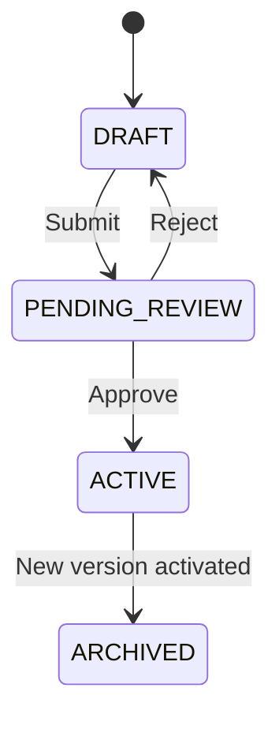

# Load Chart Versioning

## Core Principles

Load charts are **immutable once active**:

| Principle | Description |
|-----------|-------------|
| Append-only | New versions added, never modified |
| Versioned | Each chart has incremental version number |
| Immutable | Active charts cannot change |
| Auditable | Full history preserved |

## Lifecycle States



## Version Schema

```sql
-- Version 1 (archives when v2 activates)
INSERT INTO load_chart (chart_code, version, status)
VALUES ('STEP_BEAM_RF', 1, 'ARCHIVED');

-- Version 2 (current)
INSERT INTO load_chart (chart_code, version, status)
VALUES ('STEP_BEAM_RF', 2, 'ACTIVE');

-- Version 3 (in development)
INSERT INTO load_chart (chart_code, version, status)
VALUES ('STEP_BEAM_RF', 3, 'DRAFT');
```

## Effective Dating

Charts can have date-based activation:

| Field | Purpose |
|-------|---------|
| `effective_from` | When chart becomes valid |
| `effective_to` | When chart expires (optional) |

## Why Immutability Matters

1. **Auditability** — Past configurations traceable
2. **Reproducibility** — Same inputs = same outputs
3. **Safety** — No accidental overwrites
4. **Compliance** — Engineering sign-off preserved
