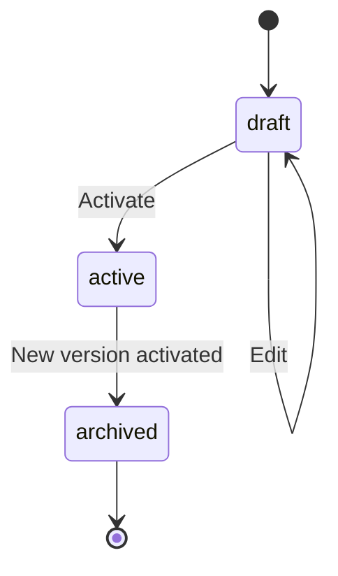

# Ruleset Versioning

## Why Rulesets Are Immutable

Rulesets are treated as **immutable** once activated for the following reasons:

1. **Auditability** - Every rule evaluation can be traced back to the exact version of rules that were applied
2. **Reproducibility** - Given the same facts and ruleset version, results are always identical
3. **Rollback Safety** - Previous versions remain intact, enabling instant rollback
4. **Compliance** - Regulatory requirements often mandate complete decision traceability
5. **Debugging** - Production issues can be reproduced using historical ruleset versions

## Versioning Model

```
Ruleset: "SPR-Elevation-Rules"
├── Version 1 (archived)
├── Version 2 (archived)
├── Version 3 (active)      ← Currently in use
└── Version 4 (draft)       ← Work in progress
```

### Version States

| State | Description | Editable | Can Evaluate |
|-------|-------------|----------|--------------|
| `draft` | Work in progress | Yes | No (test only) |
| `active` | Currently effective | No | Yes |
| `archived` | Previously active | No | Yes (historical) |

## How Activation Works

1. **Create New Version** - Clone from existing or create new draft
2. **Edit Draft** - Make changes to rules, formulas, lookups
3. **Validate** - Run automated validation and tests
4. **Approve** - Requires appropriate authorization
5. **Schedule Activation** - Set effective date/time
6. **Activate** - System automatically activates at scheduled time:
   - Current active version → `archived`
   - New version → `active`
   - Cache invalidation triggered



## How Rollback Is Done Safely

### Immediate Rollback
1. Identify target version to rollback to
2. Verify target version is in `archived` or `active` state
3. Execute rollback command
4. System atomically:
   - Marks current active version as `archived`
   - Marks target version as `active`
   - Invalidates all caches
5. New evaluations immediately use rolled-back version

### Rollback Safeguards

- **No data loss** - All versions are preserved
- **Atomic operation** - Rollback is all-or-nothing
- **Audit trail** - Rollback action is logged with reason and actor
- **Validation** - Target version must pass compatibility checks
- **Notification** - Stakeholders alerted on rollback

### Rollback Command
```http
POST /admin/rulesets/{id}/rollback
{
  "targetVersion": 2,
  "reason": "Version 3 causing incorrect beam calculations"
}
```

## Preventing Production Rule Disasters

1. **Staged Rollout** - Test in lower environments first
2. **Canary Releases** - Route small traffic percentage to new version
3. **Feature Flags** - Enable gradual rollout
4. **Monitoring** - Alert on evaluation anomalies
5. **Quick Rollback** - Sub-second rollback capability
6. **Version Comparison** - Diff between versions before activation
