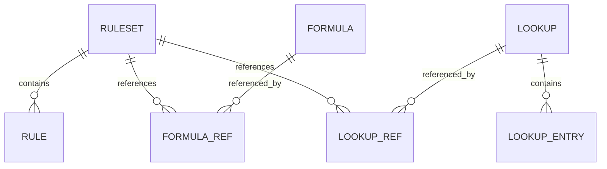

# Data Model Schema

Database schema for the Rule Service.

## Core Tables

### Rulesets
```sql
CREATE TABLE rulesets (
    id UUID PRIMARY KEY,
    name VARCHAR(255) NOT NULL,
    description TEXT,
    product_group VARCHAR(100) NOT NULL,
    version INT NOT NULL,
    status VARCHAR(50) NOT NULL, -- draft, active, archived
    effective_from TIMESTAMP,
    effective_to TIMESTAMP,
    created_at TIMESTAMP NOT NULL,
    created_by VARCHAR(255) NOT NULL,
    UNIQUE(name, version)
);
```

### Rules
```sql
CREATE TABLE rules (
    id UUID PRIMARY KEY,
    ruleset_id UUID NOT NULL REFERENCES rulesets(id),
    name VARCHAR(255) NOT NULL,
    description TEXT,
    rule_type VARCHAR(100) NOT NULL,
    condition_expression TEXT,
    action_expression TEXT,
    priority INT DEFAULT 0,
    is_enabled BOOLEAN DEFAULT true,
    created_at TIMESTAMP NOT NULL
);
```

### Formulas
```sql
CREATE TABLE formulas (
    id UUID PRIMARY KEY,
    name VARCHAR(255) NOT NULL,
    description TEXT,
    expression TEXT NOT NULL,
    version INT NOT NULL,
    status VARCHAR(50) NOT NULL,
    created_at TIMESTAMP NOT NULL,
    created_by VARCHAR(255) NOT NULL,
    UNIQUE(name, version)
);
```

### Lookups
```sql
CREATE TABLE lookups (
    id UUID PRIMARY KEY,
    name VARCHAR(255) NOT NULL,
    description TEXT,
    version INT NOT NULL,
    status VARCHAR(50) NOT NULL,
    created_at TIMESTAMP NOT NULL
);

CREATE TABLE lookup_entries (
    id UUID PRIMARY KEY,
    lookup_id UUID NOT NULL REFERENCES lookups(id),
    key_values JSONB NOT NULL,
    result_value JSONB NOT NULL
);
```

## Entity Relationships


