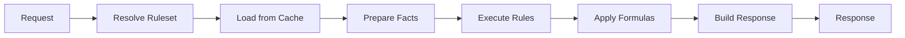

# Evaluation Pipeline

How rule evaluation actually happens at runtime.

## Pipeline Overview



## Rule Resolution Order

Rules are resolved and executed in the following order:

### 1. Ruleset Selection
```
Input: productGroup, evaluationTime
Output: Active ruleset version

SELECT * FROM rulesets
WHERE product_group = :productGroup
  AND status = 'active'
  AND effective_from <= :evaluationTime
  AND (effective_to IS NULL OR effective_to > :evaluationTime)
ORDER BY effective_from DESC
LIMIT 1
```

### 2. Rule Ordering Within Ruleset
Rules execute based on:
1. **Phase** - Pre-validation → Calculation → Post-validation
2. **Priority** - Higher priority executes first (descending)
3. **Dependency** - Rules depending on others execute after dependencies
4. **Declaration Order** - Tie-breaker for same priority

```
Phase: Pre-validation
  ├── Rule: input-validation (priority: 100)
  └── Rule: constraint-check (priority: 90)

Phase: Calculation
  ├── Rule: beam-height-calc (priority: 100)
  ├── Rule: frame-depth-calc (priority: 100)  ← parallel eligible
  └── Rule: load-calculation (priority: 50, depends: beam-height-calc)

Phase: Post-validation
  └── Rule: stability-check (priority: 100)
```

### 3. Formula Execution
Within a rule, formulas execute:
1. Resolve formula by ID/name
2. Bind input facts to formula parameters
3. Evaluate expression
4. Return computed value

### 4. Lookup Resolution
Lookups are resolved:
1. Match input keys against lookup entries
2. Return first matching result
3. Apply default if no match (if configured)

## Pipeline Stages

| Stage | Description | Cacheable |
|-------|-------------|-----------|
| Resolve Ruleset | Find active version | Yes |
| Load Ruleset | Load rules, formulas, lookups | Yes |
| Prepare Facts | Validate and normalize input | No |
| Execute Rules | Run rule conditions and actions | No |
| Apply Formulas | Compute formula expressions | No |
| Build Response | Assemble evaluation result | No |

## Error Handling

- **Validation Error** - Returns immediately with error details
- **Rule Execution Error** - Logs error, continues or halts based on config
- **Formula Error** - Returns error for specific formula, rule marked failed
