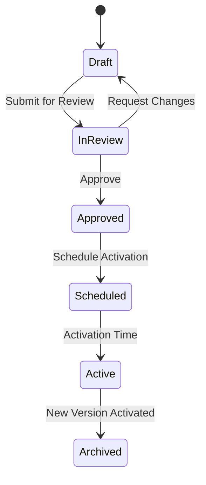

# Approval Workflow

Governance process for ruleset changes.

## Workflow Stages



## Roles and Permissions

| Role | Create | Edit | Submit | Approve | Activate | Rollback |
|------|--------|------|--------|---------|----------|----------|
| Rule Author | ✅ | ✅ | ✅ | ❌ | ❌ | ❌ |
| Technical Lead | ✅ | ✅ | ✅ | ✅ | ❌ | ✅ |
| Product Owner | ❌ | ❌ | ❌ | ✅ | ❌ | ❌ |
| Release Manager | ❌ | ❌ | ❌ | ❌ | ✅ | ✅ |
| Admin | ✅ | ✅ | ✅ | ✅ | ✅ | ✅ |

## Approval Requirements

### Standard Changes
- 1 Technical Lead approval
- Automated validation passed

### Business Rule Changes
- 1 Technical Lead approval
- 1 Product Owner approval
- Automated validation passed

### Critical/High-Risk Changes
- 2 Technical Lead approvals
- 1 Product Owner approval
- 1 Release Manager approval
- Automated validation passed
- Manual testing evidence

## Approval API

```http
POST /admin/rulesets/{id}/versions/{version}/approve
Authorization: Bearer {token}
{
  "decision": "APPROVED",
  "comments": "Reviewed and tested in staging environment"
}
```

## Audit Trail

All approvals are logged:
```json
{
  "action": "APPROVE",
  "rulesetId": "rs-001",
  "version": 4,
  "approver": "tech.lead@company.com",
  "timestamp": "2026-01-09T10:00:00Z",
  "comments": "Reviewed and tested"
}
```
